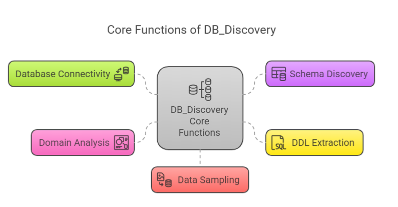

    
# Db Discovery 

## Perform database discovery on ANY database to generate the Schema and Data Discription Language.

    

    
## Table of Contents

- [Solution Overview](#solution-overview)
- [Who will use this ?](#who-can-use)
- [Advantages of Using](#advantages-of-using)
- [Return on Investment (ROI)](#return-on-investment-roi)
- [How it Works](#how-it-works)
- [Conclusion](#conclusion)
- [Getting Started](#getting-started)
- [Solution Features](#solution-features)
- [Code Features](#code-features)
- [Deliverables or Figures](#deliverables-or-figures)
- [Contact Information](#contact-information)

### **DB_Discovery Software Module**

The **DB_Discovery** module is designed to explore previously unknown relational databases and automatically discover their schema, extract Data Definition Language (DDL), and provide insights into the database's content and domain. Its primary purpose is to assist developers, data analysts, and domain experts in understanding the structure and content of databases, regardless of their underlying technology (e.g., PostgreSQL, Oracle, SQL Server, SQLite).

---

### **Core Functions of DB_Discovery**

#### 1. **Database Connectivity**
   - **Description:** Establish connections with various types of relational databases. The function supports multiple database management systems (DBMS) like PostgreSQL, Oracle, SQL Server, SQLite, and others by leveraging universal database drivers (e.g., JDBC, ODBC, SQLAlchemy).
   - **Value:**
     - Ensures compatibility across diverse database systems.
     - Eliminates manual configuration by detecting and adapting to the target database's connection protocols.

---

#### 2. **Schema Discovery**
   - **Description:** Automatically retrieves the schema metadata, including table names, column names, data types, constraints, primary keys, foreign keys, and indexes.
   - **Value:**
     - Provides a comprehensive overview of the database's structure.
     - Facilitates quick understanding of relationships between tables and their purpose.

---

#### 3. **DDL Extraction**
   - **Description:** Generates the database's DDL, including `CREATE TABLE`, `CREATE INDEX`, and other SQL statements required to recreate the schema in another environment.
   - **Value:**
     - Simplifies database replication or migration.
     - Aids in creating backups of the database structure.

---

#### 4. **Domain Analysis**
   - **Description:** Analyzes the data types, naming conventions, and relationships within the schema to infer the database's domain (e.g., e-commerce, healthcare, finance).
   - **Value:**
     - Provides context to help users align database usage with their organizational needs.
     - Accelerates domain-specific insights without requiring subject matter expertise.

---

#### 5. **Data Sampling**
   - **Description:** Retrieves a small sample of data from each table to provide a preview of the content while avoiding performance overhead.
   - **Value:**
     - Helps users understand the types of data stored.
     - Assists in data quality assessment and potential use case identification.

---

#### 6. **Cross-DBMS Abstraction**
   - **Description:** Converts the retrieved metadata and DDL into a uniform representation, abstracting away database-specific variations (e.g., Oracle’s `NUMBER` vs. PostgreSQL’s `NUMERIC`).
   - **Value:**
     - Ensures consistency when dealing with multiple databases.
     - Eases integration and comparison between heterogeneous systems.

---

#### 7. **Report Generation**
   - **Description:** Produces detailed reports in formats like JSON, CSV, Excel, or PDF, summarizing the schema, DDL, and key insights about the database.
   - **Value:**
     - Provides stakeholders with actionable documentation.
     - Streamlines communication between technical and non-technical teams.

---

#### 8. **Error Handling and Logging**
   - **Description:** Implements robust mechanisms to log errors, such as failed connections or unsupported features, while providing meaningful feedback to users.
   - **Value:**
     - Enhances reliability and user experience.
     - Facilitates debugging and troubleshooting.

---

#### 9. **Security Compliance**
   - **Description:** Ensures that the exploration process adheres to security best practices, including encrypted connections, sanitized queries, and minimal access privileges.
   - **Value:**
     - Protects sensitive data and mitigates risks of unauthorized access.
     - Builds trust in the module's use for sensitive or production environments.

---

### **Value of the DB_Discovery Module**

1. **Time Savings:** Automates schema discovery and DDL extraction, saving hours of manual investigation.
2. **Cross-DBMS Flexibility:** Works seamlessly with multiple database platforms, eliminating the need for platform-specific tools.
3. **Improved Data Understanding:** Provides insights into the database's structure and domain, helping users align data with business needs.
4. **Facilitates Data Integration:** Simplifies combining data from disparate systems by standardizing schemas and DDLs.
5. **Ease of Migration:** Supports database migrations by extracting and converting schemas into reusable DDL.
6. **Enhanced Documentation:** Produces comprehensive reports that improve collaboration and knowledge sharing.

---

The **DB_Discovery** module is a versatile, cross-platform tool that simplifies understanding and integrating unknown databases into existing workflows, unlocking value for technical teams and business users alike.

 
 

    

    
## Getting Started

The goal of this solution is to **Jump Start** your development and have you up and running in 30 minutes. 

To get started with the **Db Discovery** solution repository, follow these steps:
1. Clone the repository to your local machine.
2. Install the required dependencies listed at the top of the notebook.
3. Explore the example code provided in the repository and experiment.
4. Run the notebook and make it your own - **EASY !**
    
## Solution Features

- Easy to understand and use  
- Easily Configurable 
- Quickly start your project with pre-built templates
- Its Fast and Automated
- Saves You Time 

## Code Features

These features are designed to provide everything you need for **Db Discovery** 

- **Self Documenting** - Automatically identifes major steps in notebook 
- **Self Testing** - Unit Testing for each function
- **Easily Configurable** - Easily modify with **config.INI** - keyname value pairs
- **Includes Talking Code** - The code explains itself 
- **Self Logging** - Enhanced python standard logging   
- **Self Debugging** - Enhanced python standard debugging
- **Low Code** - or - No Code  - Most solutions are under 50 lines of code
- **Educational** - Includes educational dialogue and background material

    
## List of Figures
    
    

## Github https://github.com/JoeEberle/ - Email  josepheberle@outlook.com 
    

    